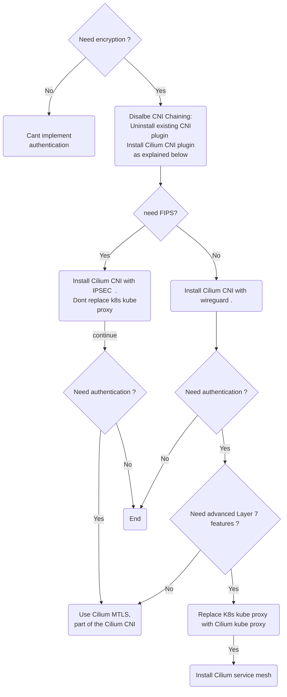

## Decision graph

temporary clarification before opening PR to Cilium documentation . 
the flow is based on https://isovalent.com/blog/post/2022-05-03-servicemesh-security/ .

## Remarks 
Disalbe CNI Chaining - remove the exising CNI ( ie - in AWS remove aws node)  
Light mtls - based on SPIFEE/SPIRE , without Envoy as sidecar .
Currently encryption is must for authentication - https://docs.cilium.io/en/latest/network/servicemesh/mutual-authentication/mutual-authentication/?utm_source=thenewstack&utm_medium=website&utm_content=inline-mention&utm_campaign=platform

