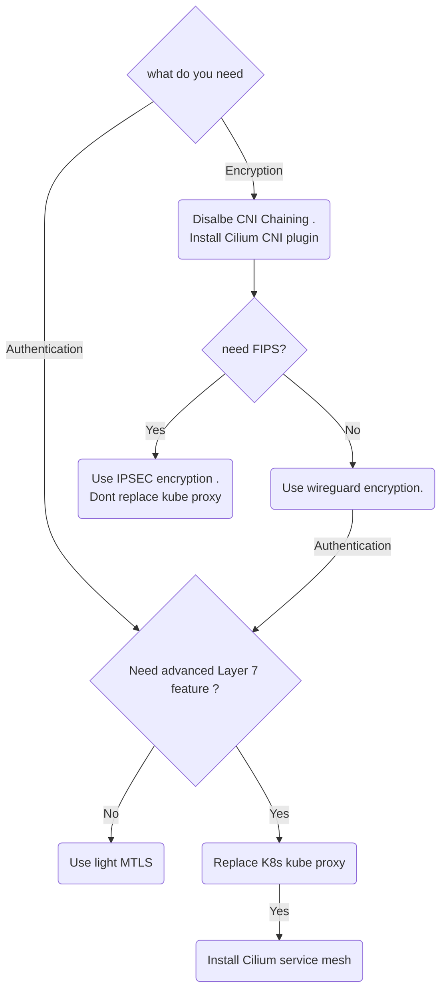

## Decision graph

temporary clarification before opening PR to Cilium documentation 

## Remarks 
Disalbe CNI Chaining - remove the exising CNI ( ie - in AWS remove aws node)  
Light mtls - based on SPIFEE/SPIRE , without Envoy as sidecar .

