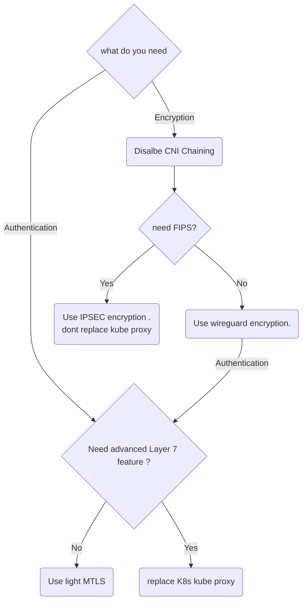

# cilium-deployment

temp location for Cilium deployment options 

## decision graph

## details
Disalbe CNI Chaining - remove the exising CNI ( ie - in AWS remove aws node)
Light mtls - based on SPIFEE/SPIRE , without Envoy as sidecar .
